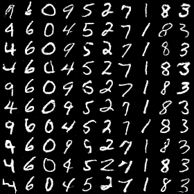

## Notice
These models have been updated to run with PyTorch 0.4

## Options
```bash
$ # read or edit ConditionalVAE/args.py
```

## Conditional VAE

### training and evaluate
```bash
$ python3 preprocess_dataset.py
$ cd ConditionalVAE # train.py and eval.py assume you are here.
$ python3 train.py
$ python3 eval.py

# results
$ cd ConditionalVAE
$ tensorboard --logdir save
```

### generate any digit sequence (after training)
```bash
$ cd ConditionalVAE
$ python3 eval.py --num-seq 87639487
$ tensorboard --logdir save
```

### example from decoder


## infoGAN
```bash
# most of the commands are identical as above
# cd to infoGAN and enjoy
```

### example from generator
